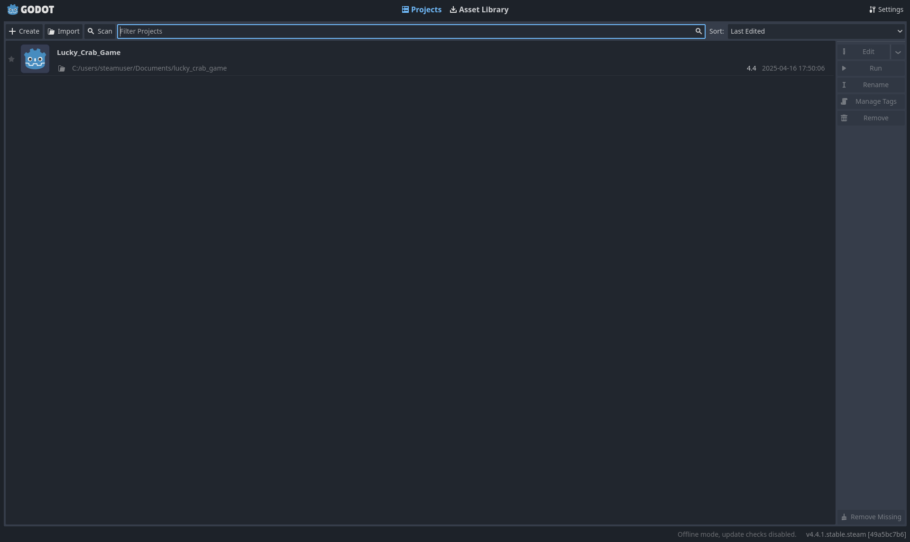
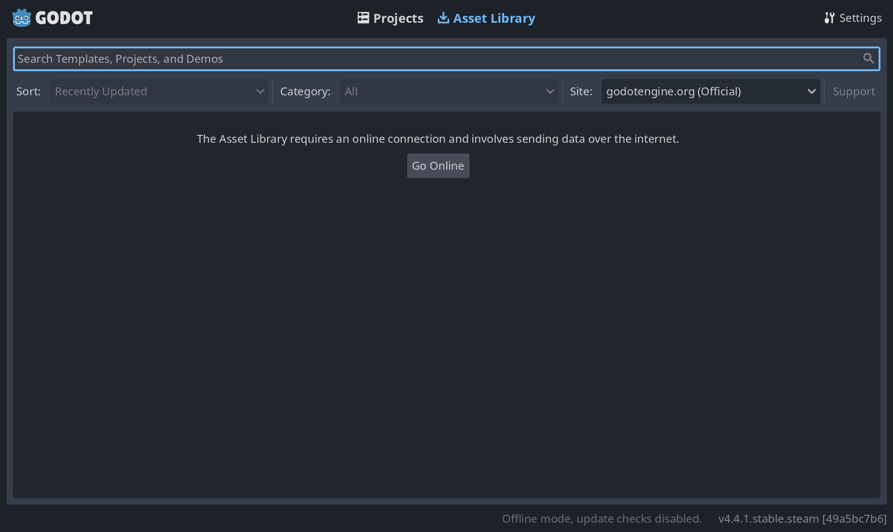
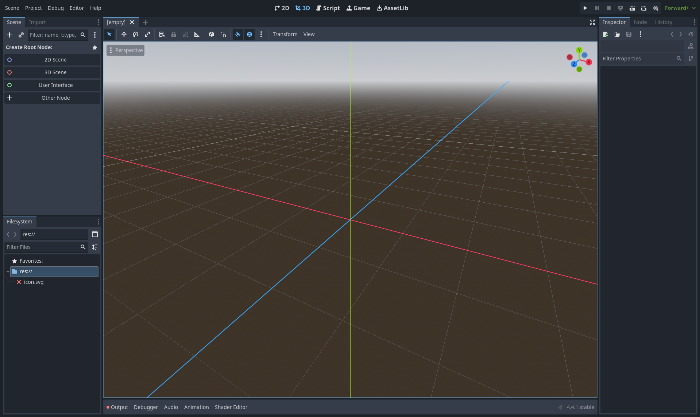
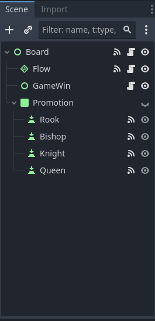
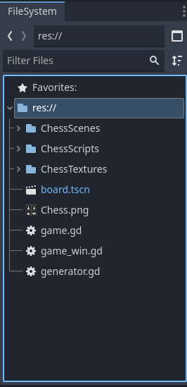
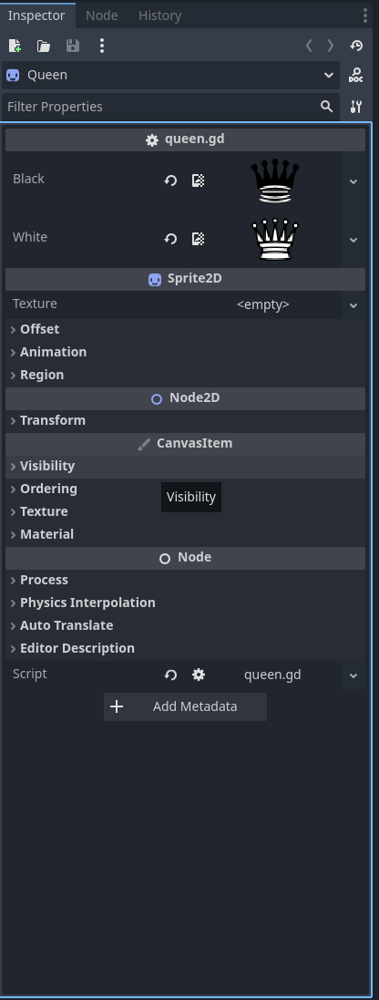
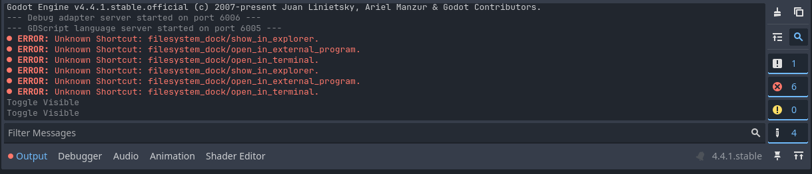
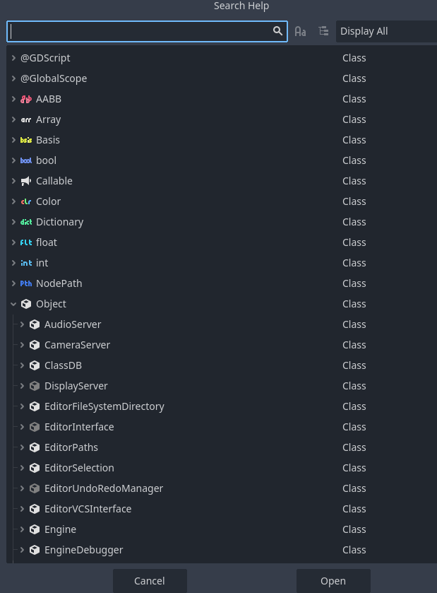
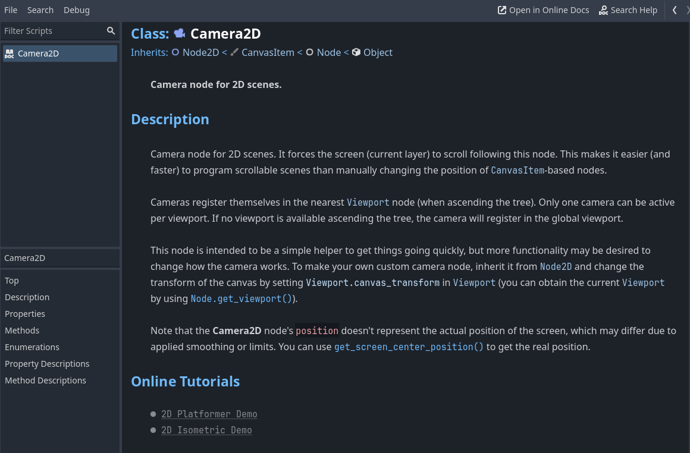

# A Interface do Godot

Como o Godot é uma engine extremamente completa, competindo até mesmo com gigantes do mercado como Unity e Unreal, sua interface possui uma infinidade de abas, janelas, botões e subdivisões para serem exploradas. Contudo, de alguma forma, é tudo muito bem organizado, tudo tem o seu lugar, basta que nós nos acostumemos com este novo mundo.

## O Gerenciador de Projetos

A primeira coisa que você vê quando abre o Godot pela primeira vez é algo parecido com isso:

Obviamente não haverá nenhum projeto já criado (como há o Lucky Crab Game, na imagem), mas quando você criar algum, ele aparecerá nesta página.

Essa tela é o gerenciador de projetos, e nela você consegue criar, importar, rodar e editar seus projetos.

No topo da página, você pode ver que há uma outra aba chamada `Asset Library`, que é onde você vai encontrar assets disponibilizados *pela* comunidade do Godot *para* a comunidade Godot. Ou seja, uma biblioteca com assets que você pode usar no seu próprio jogo.

> Assets são imagens, templates e outros arquivos que vão te ajudar a criar jogos maravilhosos.

Ao entrar na biblioteca de assets pela primeira vez, você verá uma mensagem dizendo que você precisa ficar online para acessá-la, e então você deve clicar no botão "go online" para acessar a biblioteca:

## O Editor

Ao selecionar um projeto, você será levado para uma tela como essa:

Aqui é onde você passará a maior parte do seu tempo ao fazer jogos com Godot.

No centro, a parte que ocupa a maioria da tela, temos o "Workspace" que vai alternar entre 5 funções, de acordo com os 5 botões que temos no centro-topo da tela: `2D`, `3D`, `Script`, `Game`, `AssetLib`.

### 2D

Mostra o viewport 2D da cena atual do seu jogo, usado para criar jogos 2D ou interfaces de usuário para jogos 3D. Nele você pode mover, aumentar, diminuir e rotacionar suas cenas 2D livremente.

### 3D

Mostra o viewport 3D da cena atual do seu jogo, usado para mexer com meshes e iluminação. Permite que você mexa suas cenas 3D por aí.

### Script

Um editor de texto embutido na engine com debugger e auto-complete.

### Game

É onde o seu jogo vai aparecer quando você rodar ele dento da engine. Aqui você pode pausar seu jogo no meio da execução e editá-lo em tempo real. Contudo, qualquer mudança feita no jogo durante este período não será persistente.

### AssetLib

É aquela mesma biblioteca de assets que vimos agora a pouco

### Scene e FileSystem

Na esquerda, fora do workspace central, temos duas janelas: a de cenas e o sistema de arquivos. Na janela de cenas, você consegue ver sua árvore de cenas, além de poder criar novas e aninha-las como desejar.

Já na jenela do sistema de arquivos, você consegue ver e organizar todas as suas pastas, cenas, scripts, assets e arquivos no geral.

### Inspetor

Na parte direita da tela, temos o `Inspetor`, que é onde você consegue ver e editar as propriedades de uma cena, como neste exemplo em que temos a cena "rainha" de um jogo de xadrez:

### Painel inferior

Na parte mais baixa da tela, temos um painel que está contraído mas que se expande quando clicamos um de seus modos. Este painel é muito útil e versátil, sendo seus modos: `Output`, `Debugger`, `Audio`, `Animation`, `Shader Editor`. Ou seja, ele serve para ver outputs no console, para debuggar scripts, para editar audios, criar e editar animações e editar shaders. Uau!

### Referência de Classes Integrada

Além de tudo isso, não podemos deixar de citar a referência de classes que vêm integrada com o Godot. Ela é basicamente uma super documentação de todas as classes que existem na engine, incluindo todos os nós.

Ao

- apertar `f1`
- clicar em `Search Help` na página de Scripts, ou
- clicar em `Search Help` no menu `Help`

uma janela com a lista de todas as classes do Godot aparecerá, assim:

E então, quando você selecionar a classe que você quer saber mais sobre, uma página com toda a documentação dela surgirá:

## Conclusão

Vimos aqui o principal da navegação na GUI do Godot, mas eu recomendaria que você abrisse a engine você mesmo e saísse clicando em tudo para ver 'coméquié', pois só ler sobre a interface não substituirá a experiência de usá-la.

Enfim, vejo você no próximo capítulo!
