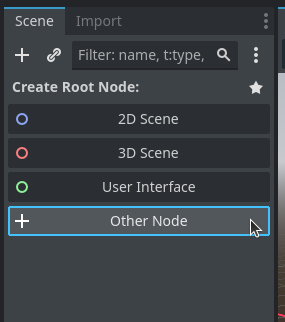
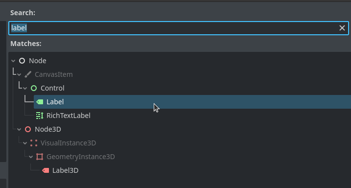
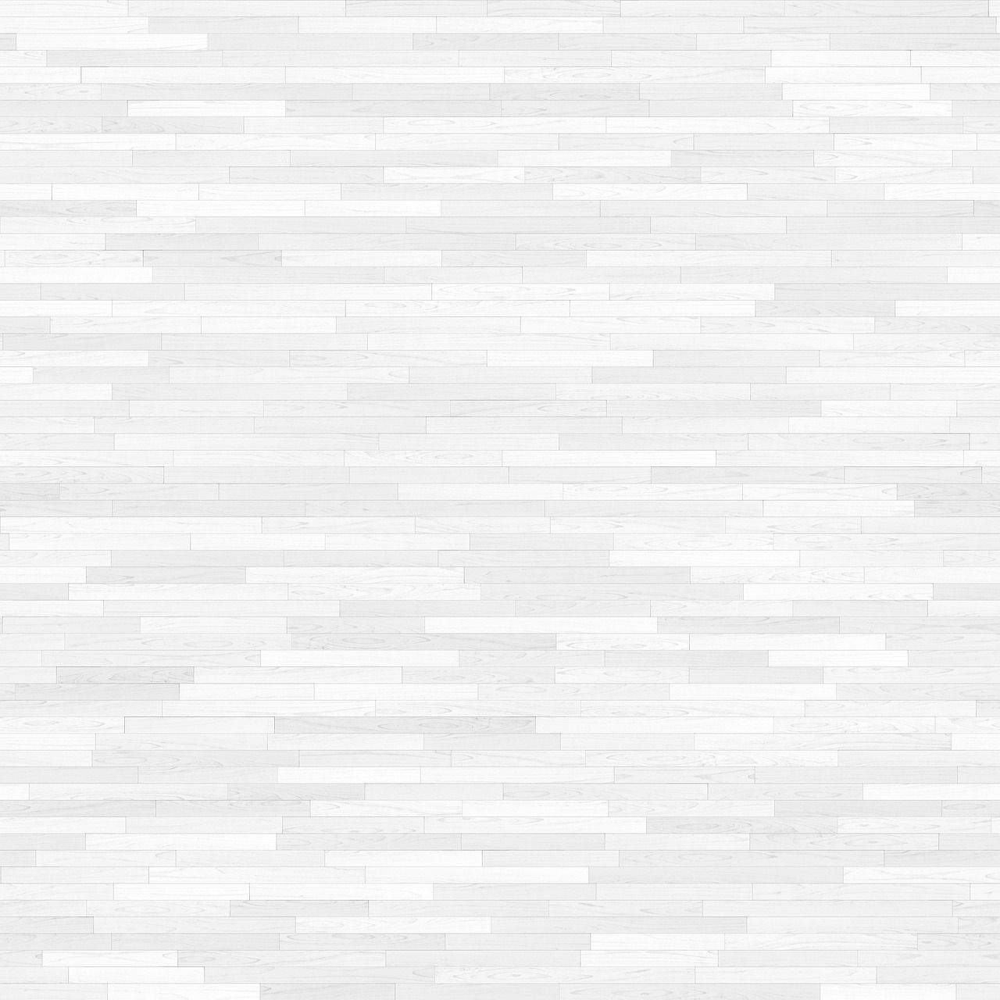

# Criando Cenas e Nós
Explicamos o que são Cenas e Nós a apenas 2 capítulos atrás, então vou assumir que você lembra da parte teórica (senão vá ler o capítulo de novo). Mas aqui vai uma recapitulação:

1. **Nós** (Nodes): são os blocos fundamentais do seu jogo, eles podem ser coisas simples como uma imagem, a algo mais complexo como um player;
2. **Cenas** (Scenes): são árvores de nós, podemos agrupar nós e produzir frações reutilizáveis do nosso jogo, como um cenário, ou um jogador.

Agora chega de aula, vamos ver na prática o que é um nó e uma cena.

## Criando um novo projeto
Primeiro de tudo, abra seu editor do Godot e crie um projeto como você aprendeu no capítulo passado, pode chamá-lo de qualquer coisa, como `hello-projeto`, ou seja criativo ✨.
## Criando um nó

No momento você está com uma cena vazia. À sua esquerda, o editor oferece algumas opções de cenas para serem criadas, como: `2D Scene`; `3D Scene`; e `User Interface`. Esses são modelos de cenas pré-prontos para agilizar as coisas, no momento não queremos isso. Clique em `Other Node`. Isso criará um popup onde você pode adicionar qualquer tipo de nó disponível.

Pesquise por um nó chamado `Label` e clique nele e confirme em `Create` para adicioná-lo. O nó `Label` é apenas um nó que permite que você adicione texto dentro dele.

Agora, você deve ter o nó selecionado (se ele não estiver, clique nele na árvore de nós). Sendo assim, você deve estar vendo no lado direito as propriedades do seu nó. Dentro do campo `text` insira uma frase, como "Hello, World!". 

Na tela principal, sua mensagem vai aparecer, agora clique no símbolo de múltiplas setas que deve estar acima da tela central, ou aperte `w`, para entrar no modo de movimento. 

![[Pasted image 20250514192620.png]]

Feito isso, arraste o seu *Label* para o centro da tela.
![[Pasted image 20250514192725.png]]

Excelente! Está na hora de executar essa cena.
## Executando a Cena

Aperte o botão *Run current Scene*, no canto superior direito ou aperte `F6`. Ao fazer isso pela primeira vez, um popup irá abrir pedindo para inserir o nome em que a cena será salva, coloque *label* e aperte para *Salvar*. 
![[Pasted image 20250514194317.png]]
Agora o sua cena deve aparecer em *FileSystem* no canto inferior esquerdo dentro da pasta `res://`. Após salvar a cena, uma nova janela deve abrir e você deve ver um fundo cinza com sua mensagem escrita no meio. Meus parabéns você criou sua primeira cena.

![[Pasted image 20250514194939.png]]
Eu entendo, não é a tela mais bonita ou interessante do mundo, mas o que conta é a personalidade! Você pode fechar a tela com `F8` e rodar a mesma cena novamente com `F5` (*Run project scene*).

## Instanciando Cenas

Nesse último exemplo nós criamos uma única cena, mas um projeto pode ser composto por uma variedade de cenas agrupadas em arquivos  `.tscn`. Isso permite modelar situações mais complexas. Uma vez que uma cena é construída, você pode replicá-la em outras cenas, chamamos isso de **instanciamento** (*instancing*).
## Jogando Basquete

Hora de botar a mão na massa e montar um projeto simples, faremos uma superfície onde uma bola de basquete vai quicar.

Bem legal certo? ~~Por favor diga que sim 😢 ~~. Para chegarmos a esse resultado vamos criar 3 cenas, a ***principal***, a ***parede***, e a ***bola***. Sendo a primeira uma composição das duas últimas.

Fique à vontade para criar outro projeto, ou usar o mesmo que estávamos utilizando. Eu irei criar uma projeto em branco chamado *basket-ball*.
### A Bola

A bola do jogo, o elemento mais importante da nossa cena. Vamos criar uma cena que contém apenas nossa bola de basquete. 

Faremos como no exemplo anterior, criaremos um nó raiz, escolhendo a opção `Other Node`. Pesquise pela opção `RigidBody2D` e crie-o. Você não verá muita coisa na tela, estamos apenas definindo as propriedades de um corpo rígido (um sólido afetado pela física) de 2 dimensões, precisamos dar forma ao nosso corpo. Criaremos um nó filho chamado `CollisionShape2D`. Na árvore de nós selecione o nó raiz e clique com o botão direito, e selecione `Create child node`, ou aperte `Ctrl-A`. O nó `CollisionShape2D` faz exatamente o que ele indica, ele concede uma forma 2D ao nó pai. Temos que agora definir essa forma. Na aba *inspector* à sua direita você verá um campo chamado *Shape*, selecione `New CircleShape2D`, nosso nó tomará a forma de uma bola.
![[Pasted image 20250521150354.png]]

Muito bem, se você forçar a vista verá um pequeno circulo azul na sua tela principal, aquilo é nossa corpo rígido. Use o mouse e arreste para o centro da cena, depois disso, segure o ponto vermelho do circulo e ajuste seu raio. Algo assim:
![[Pasted image 20250521150758.png]]
Temos nossa bola, ou pelo menos sua forma física. Precisamos concedê-la uma aparência, e para fazer isso, vamos adicionar uma imagem para nosso nó. Crie um novo nó para nosso `RigidBody2D`, escolha o tipo `Sprite2D`, um *sprite* é uma imagem na linguagem dos jogos. Agora precisamos uma imagem, você pode usar essa daqui:

(Essa imagem foi retirada do [PixaBay](https://pixabay.com/vectors/basketball-ball-sport-orange-ball-147794/), feita pelo [Openclipart-vectors](https://pixabay.com/users/openclipart-vectors-30363/)). 

Ou use a image que preferir.

Adicione sua imagem ao *FileSystem* do projeto (jogue a imagem lá). Agora, vá para o inspetor do sprite e jogue a imagem do *FileSystem* para o campo *Texture*. Em primeira instância, sua imagens estará fora de escala, ajuste o tamanho dela para caber dentro do *collision* *shape* (ou ajuste o collision shape). O resultado deve se parecer com isso.
![[Pasted image 20250521160848.png]]
Muito bem, vamos rodar essa cena. Pressione `F5` e salve o arquivo como `ball.tscn`. Veja a mágica acontecer.

Uau que incrível! Agora aqui vai a explicação do que você viu. Nossa bola foi criada, e puxada para baixo pela gravidade *ad infinitum*, uma vez que não criamos um chão (Oops). Antes de partir para a próxima etapa, vamos ajustar mais uma coisa. Vamos renomear nosso nó raiz para *Ball*, para que quando reutilizarmos esse nó, consigamos diferenciá-lo de outros *RigidBody2D*. Clique no nó e selecione *Renomear*. **Não esqueça de salvar**. Pronto! Hora de criar nossa parede (chão).
### A Parede

Vamos criar nossa segunda cena. Crie uma nova aba, clicando no *+* na aba de cenas ou apertando `Ctrl-N`. Essa cena será nosso chão ou parede. Queremos um corpo rígido que não é afetado pela gravidade, senão ele cairia junto com a bola, felizmente o *Godot* nos fornece um nó com essas características. Chamado *StaticBody2D*, ele será a raiz da nossa cena. Você já sabe como fazer (ou pelo menos deveria...)! 

Agora repetiremos os passos da criação da bola. Queremos atribuir uma forma física e uma *sprite* à nossa cena. Crie um *Sprite2D* e *CollisionShape2D*.  Para nossa forma selecione o *RectangleShape2D*, e ajuste o tamanho. E, para nossa *sprite*, adicione a seguinte imagem ao seu projeto:
 
(Essa imagem foi retirada do [PixaBay](https://pixabay.com/photos/floor-home-pattern-texture-624772/), feita pelo [jewolf](https://pixabay.com/users/jewolf-752106/))

Depois disso, ajuste o tamanho da imagem e da caixa de colisão para algo que caiba na tela. Veja como meu exemplo ficou:

![[Pasted image 20250521202044.png]]

Temos uma tábua! Vamos salvar e renomear nosso nó como *wall* (eu sei que é um chão!), e rodar nossa cena.

![[Pasted image 20250521202516.png]]
Exuberante!
### A Cena principal

Você está indo muito bem! Para a última etapa vamos juntar todas as cenas que criamos em uma única cena. Crie uma nova cena dessa vez sua raiz será apenas um *Node2D* -- um nó genérico sem muita personalidade 👀. 

Desse jeito, vamos adicionar instâncias das cenas que já criamos. Apertando `Ctrl-Shift-A`, ou apertando o botão direito e selecionando *Instantiate Child Scene*. Isso abrir um *popup* com as cenas dentro do projeto, selecione e adicione ambas. Ótimo, agora nosso piso e bola estão na mesma cena. Posicione de uma forma em que a bola caia em cima da plataforma.

![[Pasted image 20250521230840.png]]

Desse jeito está bom. Vamos rodar a nossa cena.

Conseguimos fazer o que pretendíamos, mas ainda não está satisfatório. Afinal de contas, uma bola de basquete é feita de borracha, ela precisa quicar ao cair de uma certa altura. Felizmente, podemos resolver isso com algumas modificações. De volta para a cena da bola. 

Queremos modificar alguns parâmetros do nosso corpo rígido. Para fazer precisamos sobre-escrever as propriedades físicas do nosso nó. Selecione o nó raiz e vá para a seção de inspeção. No campo *Physical Material*, selecione *New Physical Material*. Nessa aba, podemos modificar atributos como *bounce* (elasticidade) e *friction* (fricção). Coloque *bounce* como 1 e *friction* como 0. Salve a cena. Atualizações na cena original serão repassadas a todas as suas instâncias. Agora rode a cena principal novamente, e veja o resultado.

## Editando Instâncias

Já vimos que é possível editar uma cena e atualizar suas instâncias, mas será que podemos **atualizar instâncias individualmente**? A **resposta é sim**!  Vamos criar outras bolas dentro da nossa cena principal. 

Primeiro, crie outra instância da bola, ela receberá automaticamente o nome de *Ball2*. Para modificar suas propriedades, selecione-a, e vá para o inspetor, no campo *Physical Material*, clique para criar um *New Physical Material* e edite suas propriedades.

![[Pasted image 20250521234021.png]]

Rodando nossa cena veremos como as duas bolas se comportam de jeitos distintos. Brinque um pouco com esses valores e veja o resultado.

## Conclusão

Nesse tutorial exploramos os conceitos mais fundamentais do Godot. Além disso, pensar em cenas e instâncias ajuda a **montar** **a estrutura do seu jogo**. Por exemplo, você pode criar uma cena que recebe instâncias de todos os objetos visíveis pelo seu jogador, e modificá-las com base em necessidades específicas. Na próxima vez que estiver criando um jogo, tente modelar um diagrama de cenas, para entender melhor quem instância quem. Acredite isso pode te ajudar bastante. Por hoje é só pessoal, nos vemos na próxima com mais tutoriais!
## Exercício

Agora que você aprendeu sobre nós e cenas, vamos te passar um exercício para fixar o conteúdo. Crie uma cena onde tenha várias plataformas, e bolas com diferentes propriedades físicas. Se quiser altere as *sprites* de cada bola para deixá-las únicas. 

Fique à vontade para **compartilhar** sua resolução **com** a **gente**.