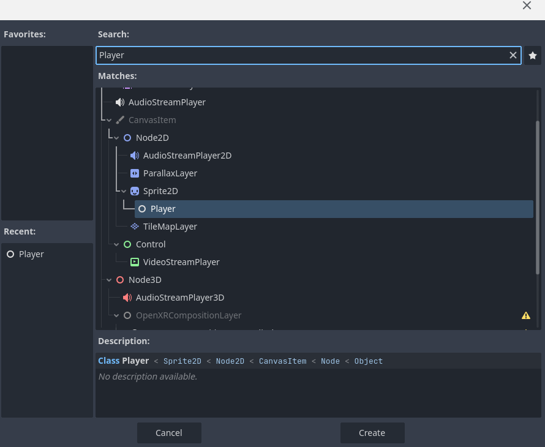
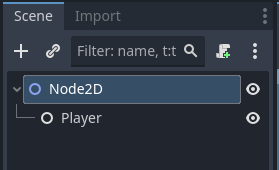
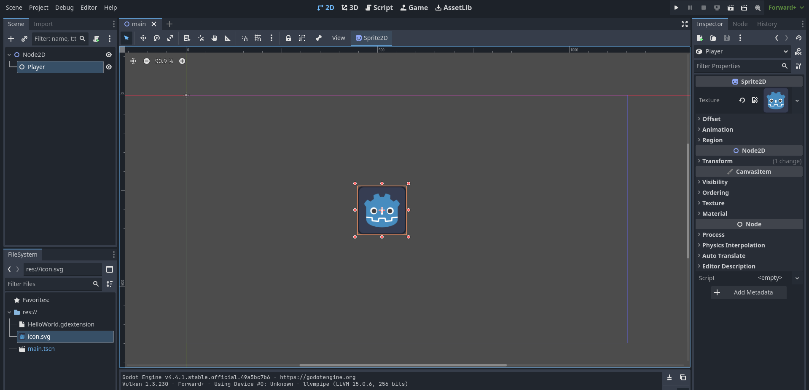

# Mexendo com Scripts

A partir daqui começa a diversão de misturar Godot com Rust. Então iremos assumir que você seguiu todo o curso até aqui e possui tanto o rust quanto o godot instalados em seu computador. Caso você não tenha, dê um passo para trás e siga os passos dos nossos capítulos 1 da Introdução a Rust e da Introdução a Godot.

## Linguagens de Script

O Godot oficialmente suporta apenas 4 linguagens: GDScript (uma linguagem criada especificamente para a engine), C#, C++ e C. Contudo, através de uma tecnologia chamada GDExtension, a comunidade é provida com as ferramentas para adicionar suporte a outras linguagens, como é o caso do [Rust](https://godot-rust.github.io/book/).

## A Estrutura do Projeto

A organização de pastas e arquivos de um projeto em "godot-rust" será um combo das organizações de um projeto godot com um projeto rust, como é de se imaginar. A hierarquia de pastas ficará assim:

```
📂 project
│
├── 📂 .git
│
├── 📂 godot
│   ├── 📂 .godot
│   ├── 📄 HelloWorld.gdextension
│   └── 📄 project.godot
│
└── 📂 rust
    ├── 📄 Cargo.toml
    ├── 📂 src
    │   └── 📄 lib.rs
    └── 📂 target
        └── 📂 debug
```

Para chegar em uma estrutura como essa, siga os seguintes passos:

1. Crie um diretório para a base do projeto com o comando `mkdir nome_do_projeto`;
2. Se quiser, inicialize seu repositório git neste diretório;
3. Abra o Godot e crie um projeto neste mesmo repositório, para manter a estrutura acima, nomeie seu projeto "godot";
4. Inicie um projeto rust no diretório base com o comando `cargo new "rust" --lib`. Colocando o nome da biblioteca como "rust" apenas para seguir a estrutura acima também.

## Preparando a base

Agora que nosso projeto tem uma estrutura de arquivos bacana, podemos começar a adicionar as peças que faltam para que tudo se encaixe perfeitamente.

A primeira coisa que faremos é adicionar o seguinte conteúdo ao `cargo.toml`:

``` toml
[lib]
crate-type = ["cdylib"]
```

Isto fará com que, quando rodarmos `cargo build`, nosso código em rust seja compilado para uma biblioteca dinâmica em C, ao invés de um binário.

Além disso, iremos colocar o nome do nosso projeto aqui:

``` toml
[package]
name = "Nome_do_Projeto"
```

No meu caso, vou colocar `name = "rustgame"`. Após isso, vamos rodar o comando `cargo add godot` no terminal, estando no nosso diretório "rust". isso irá adicionar a dependência **godot** ao nosso projeto, o que é extremamente importante para que possamos usar as funcionalidades do GDExtension em nosso código. Ao final dessas etapas, seu cargo.toml deve estar mais ou menos assim:

``` toml
[package]
name = "rustgame"
version = "0.1.0"
edition = "2024"

[lib]
crate-type = ["cdylib"]

[dependencies]
godot = "0.2.4"
```

Agora que cuidamos das coisas no lado do Rust, precisamos fazer a conexão do lado do Godot. Para isso, vamos criar na pasta `godot` um arquivo com extensão `.gdextension`. Chamemos ele de `HelloWorld.gdextension`, por exemplo. Dentro dele, precisamos colocar o seguinte conteúdo:

``` toml
[configuration]
entry_symbol = "gdext_rust_init"
compatibility_minimum = 4.1
reloadable = true

[libraries]
linux.debug.x86_64 =     "res://../rust/target/debug/lib{Projeto}.so"
linux.release.x86_64 =   "res://../rust/target/release/lib{Projeto}.so"
windows.debug.x86_64 =   "res://../rust/target/debug/{Projeto}.dll"
windows.release.x86_64 = "res://../rust/target/release/{Projeto}.dll"
macos.debug =            "res://../rust/target/debug/lib{Projeto}.dylib"
macos.release =          "res://../rust/target/release/lib{Projeto}.dylib"
macos.debug.arm64 =      "res://../rust/target/debug/lib{Projeto}.dylib"
macos.release.arm64 =    "res://../rust/target/release/lib{Projeto}.dylib"
```

Substituindo `{Projeto}` nos caminhos acima com o nome do seu projeto que você colocou no cargo.toml. No meu caso era "rustgame", então ficaria assim:

``` toml
[configuration]
entry_symbol = "gdext_rust_init"
compatibility_minimum = 4.1
reloadable = true

[libraries]
linux.debug.x86_64 =     "res://../rust/target/debug/librustgame.so"
linux.release.x86_64 =   "res://../rust/target/release/librustgame.so"
windows.debug.x86_64 =   "res://../rust/target/debug/rustgame.dll"
windows.release.x86_64 = "res://../rust/target/release/rustgame.dll"
macos.debug =            "res://../rust/target/debug/librustgame.dylib"
macos.release =          "res://../rust/target/release/librustgame.dylib"
macos.debug.arm64 =      "res://../rust/target/debug/librustgame.dylib"
macos.release.arm64 =    "res://../rust/target/release/librustgame.dylib"
```

Vamos entender o que está acontecendo aqui:

- O `entry_symbol` é o ponto de entrada definido pela extensão gd do rust, então não mexeremos em seu valor.
- A compatibilidade mínima (`compatibility_minimum`) é a versão do Godot que nosso projeto espera para poder compilar. Qualquer pessoa tentando compilar nosso código em rust mas que estiver usando uma versão mais antiga do Godot obterá um erro.
- `reloadable` é uma opção que diz se o editor do Godot deveria recarregar a extensão quando a janela entrar em foco. Isso é útil para que o editor do Godot fique sempre atualizado com nosso código em Rust conforme nós vamos modificando-o e recompilando-o. É possível que esta opção cause crashes no seu editor, então se for o caso, desative-a.
- As `[libraries]` são caminhos para os arquivos de biblioteca dinâmica gerados ao rodarmos `cargo build`. Estes caminhos utilizam um padrão próprio do Godot, e é por isso que utilizam o prefixo `"res://"` e são relativos à pasta `godot`.

Ok, se você abrir o projeto agora no editor do Godot, um arquivo chamado `extension_list.cfg` deve ser gerada na pasta `godot/.godot/`. Caso isto não ocorra, você pode criar este arquivo manualmente, e colocar nele apenas a seguinte linha, com o caminho para o `.gdextension` que acabamos de criar:

```
res://HelloWorld.gdextension
```

Se, ao abrir o godot, você notar no terminal um monte de erros dizendo que o arquivo `HelloWorld.gdextension` não foi encontrado, não entre em pânico, isto é normal por enquanto, os erros vão sumir até o fim deste capítulo.

## Escrevendo os Scripts

Agora bora finalmente para a parte de escrever nossos scripts em Rust. Em nosso lib.rs vamos colocar o seguinte código:

``` rust
// importa os principais símbolos da API do godot
use godot::prelude::*;

// Cria uma estrutura vazia para nossa extensão
// Você pode nomeá-la como quiser
struct MyExtension;

// Marca nossa estrutura com o atributo #[gdextension]
// E implementa o trait ExtensionLibrary para ela
#[gdextension]
unsafe impl ExtensionLibrary for MyExtension {}
```

Tudo isso é _boilerplate_. A diversão começa de fato quando criamos uma classe no Rust que poderá ser usada como nó dentro do Godot, que é o que faremos agora.

Primeiro iremos criar um arquivo `player.rs` na mesma pasta que o `lib.rs`. Nele, iremos colocar o seguinte código:

``` rust
// Importa o que usaremos para implementar nosso jogador
use godot::prelude::*;
use godot::classes::Sprite2D;

// Declaramos o Player como sendo uma classe do Godot
// E fazemos ele "herdar" de Sprite2D. Ou seja, Player agora é um "nó filho" de Sprite2D, como você poderá ver em breve no editor.
#[derive(GodotClass)]
#[class(base=Sprite2D)]
struct Player {
    speed: f64, 		 // Velocidade do jogador 
    angular_speed: f64,  // Velocidade angular do jogador

    base: Base<Sprite2D> // Nos permite acessar a classe base do jogador, neste caso, Sprite2D
}
```

Essa classe ainda não faz nada, ou sequer compila, pela falta de um construtor para Player, então vamos resolver isso, adicionando o seguinte código:

``` rust
// Importando a interface para os comportamentos de Sprite2D, incluindo a função init
// Cada classe tem um I{nome_da_classe} com suas funcionalidades
use godot::classes::ISprite2D;

// O #[godot_api] indica para o Godot que esta implementação é parte da API que estamos expondo para ele
#[godot_api]
impl ISprite2D for Player {
	// Declarando o constutor do Player com alguns valores padrão e uma mensagem no console do godot
    fn init(base: Base<Sprite2D>) -> Self {
        godot_print!("Hello, world!");
        
        Self {
            speed: 400.0,
            angular_speed: std::f64::consts::PI,
            base,
        }
    }
}
```

Abaixo da função `init()`, vamos adicionar mais uma função para que haja algum movimento na tela quando rodarmos o jogo - só para sabermos que está tudo rodando normalmente:

``` rust
fn physics_process(&mut self, delta: f64) {
    let radians = (self.angular_speed * delta) as f32;
    self.base_mut().rotate(radians);

    let rotation = self.base().get_rotation();
    let velocity = Vector2::UP.rotated(rotation) * self.speed as f32;
    self.base_mut().translate(velocity * delta as f32);
}
```

E por fim, não podemos esquecer de colocar a linha `mod player;` no começo do `lib.rs` para que a biblioteca encontre a classe do nosso jogador.

Com tudo isso feito, podemos reabrir o nosso projeto no Godot (não sem antes compilá-lo com `cargo build`, é claro).

Dentro do editor, que está atualmente vazio, crie uma cena 2d qualquer, e depois tente incluir nela um nó do tipo `Player`. Ele estará como um filho de Sprite2D, como na imagem abaixo.

 

Sua cena deve ficar assim:



Agora, para que o nosso jogador seja visível, vamos dar um corpo a ele, como por exemplo o asset padrão do robôzinho do Godot. Para fazer isso, basta que você arraste a imagem do robôzinho da aba `FileSystem` no canto inferior esquerdo para a propriedade *Texture* do Player, na aba `Inspector` no canto superior direito. Agora posicione o jogador no centro da tela, como na imagem abaixo:



E finalmente você pode rodar o projeto!!! O comportamento esperado é que o robô fique girando em sentido horário ao redor de onde você o posicionou.

## Conclusão

Se você está encomodado com a falta de explicações e aprofundamento sobre os códigos que você "copiou e colou" ao longo deste capítulo, segura firme. O objetivo deste capítulo era apenas que nós juntassemos algumas peças para obter uma integração mínima entre o Godot e o Rust. Nos próximos capítulos explicaremos tudo em mais detalhes e então os códigos começarão a fazer mais sentido (provavelmente).

Ufaaa... foi um tanto trabalhoso né? A boa notícia é que a maior parte foi só um monte de etapas preparatórias que só precisamos fazer uma vez por projeto. Nos capítulos seguintes iremos nos aprofundar mais na API do Godot para Rust, e explorar os verdadeiros poderes dessa dupla letal. Até lá! :D