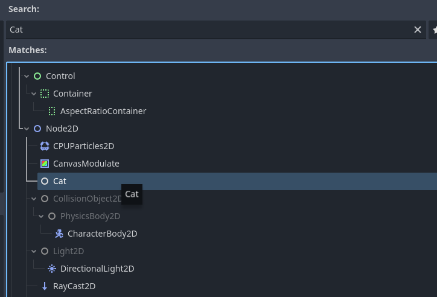
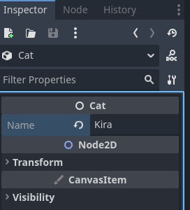
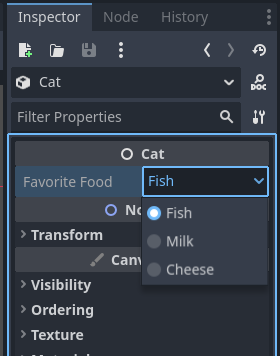

# Registrando Símbolos do Rust no Godot

Se lembra do código que escrevemos no capítulo 05 para registrar nossa classe Player dentro do Godot e usar ela dentro do editor? O que vamos fazer neste capítulo é nos aprofundar neste tema, e aprender a registrar

- **Classes**
- **Funções**
- **Propriedades**
- **Constantes**
- e mais...

Ou seja, nós vamos entender melhor do que se tratava aquele código que não foi tão bem explicado, além de compreender melhor como funciona a integração entre o Rust e o Godot.

## Registrando Classes

Como o Rust não possui classes de fato, nossas classes serão criadas se utilizando `struct`s. Então, como exemplo, bora criar uma classe `Cat` e integrar ela com o Godot.

O primeiro passo será criar a struct como você normalmente faria em Rust:

``` rust
struct Cat {
	name: String,
	age: i32,
}
```

E depois, tudo que precisamos fazer é indicar que a classe pode ser usada na engine do Godot utilizando alguns macros:

``` rust
#[derive(GodotClass)] // Registra a classe no banco de classes do Godot
#[class(init)] // veremos o que é isso depois
struct Cat {
	name: String,
	age: i32,
}
```

Pronto, na prática isso é tudo de que precisamos para que a classe fique utilizável dentro da engine. Contudo, atualmente esta classe não faz nada e não pode ser usada como um nó, diferentemente da nossa classe Player.

Para que nossa classe possa ser adicionada à árvore de cenas, precisamos definir qual será a classe **base** dela. Se quisermos um nó genérico, podemos simplesmente falar que a classe base de `Cat` é a classe `Node`, mas se quisermos ser mais específicos, podemos utilizar algum outro nó, como `Node2D`. Se não definirmos nenhuma classe base, nossa classe herdará por padrão a `RefCounted`.

> Como já dito no capítulo 6, no Rust nós usamos **composição** ao invés de herança, então na verdade nossa classe customizada não herdará nada da classe base. Ao invés disso, teremos um atributo chamado "base", por meio do qual nós poderemos acessar a classe base.

``` rust
use godot::classes::Node2D; // Importando a classe base

#[derive(GodotClass)]
#[class(base=Node2D)] // Definindo que nossa classe Cat é filha de Node2D
struct Cat {
	name: String,
	age: i32,
	base: Base<Node2D> // Um atributo que serve como ponto de acesso à classe base
}
```

O tipo `Base<T>` nos é proporcionado pelo gdext. Quando declaramos um atributo base na nossa classe, o macro `#[derive]` percebe isso e nos dá acesso à API da classe base através dos métodos `self.base()` e `self.base_mut()`.

E pronto, com isso nossa classe pode se tornar um nó da árvore, como você sempre sonhou!! **Só que não**. Se você tentar compilar este código, você receberá um erro na cara dizendo que sua estrutura `Cat` precisa implementar um método `init`, ou seja, um construtor.

E é mais ou menos para isso que a gente usa aquele `#[class(init)]` de antes; ele meio que cria um construtor padrão pra gente. Veremos mais sobre isso na parte sobre **construtores**. Por enquanto, saiba que se substituirmos a linha `#[class(base=Node2D)]` no nosso código para ser `#[class(init, base=Node2D)]`, aí sim nosso código compila e nós podemos ver nossa classe como um nó no editor da engine:



## Registrando Funções

Registrando funções nós poderemos acessá-las pela engine e em scripts feitos com GDScript, assim como as nossas classes. O registro de funções gira em torno de blocos `impl` ennfeitados com o macro `#[godot_api]`.

Toda classe própria do Godot - como Node2D - tem uma interface I{nome_da_classe}, como dissemos no capítulo 5. Essa interface possui métodos que podem ser sobrescritos para que sua classe funcione de um jeito único. Estes métodos então vão ou ser chamados em momentos específicos do ciclo de vida dos objetos dessa classe, ou vão ficar disponíveis para serem chamados através do GDScript. Aqui estão alguns métodos da interface `INode2D`:

``` rust
#[godot_api]
impl INode2D for Cat {
    // Inicializa um objeto
    fn init(base: Base<Node3D>) -> Self { ... }
    // Chamado quando o nó fica pronto na árvore da cena
    fn ready(&mut self) { ... }
    // Chamado todo frame
    fn process(&mut self, delta: f64) { ... }
    // Chamado todo frame de física
    fn physics_process(&mut self, delta: f64) { ... }
    // Retorna uma representação em string do objeto
    fn to_string(&self) -> GString { ... }
    // Lida com um input do jogador
    fn input(&mut self, event: Gd<InputEvent>) { ... }
    // ...
}
```

Então para implementar o `to_string()` para nossa classe `Cat`, faríamos o seguinte:

``` rust
#[godot_api]
impl INode2D for Cat {      
    fn to_string(&self) -> GString {
        let Self { name, age, .. } = &self; // desestruturando self para as variáveis name e age
        format!("Cat(name={name}, age={age})").into()
    }
}
```

Agora, se você quiser criar seus próprios métodos ao invés de sobrescrever os que já existem, então terá que - além de usar o macro `#[godot_api]` no bloco `impl` - usar o macro `#[func]` em cada método. Como no exemplo a seguir:

``` rust
#[godot_api]
impl Cat {
	#[func]      
    fn get_name(&self) -> GString {
    	self.name.clone()
    }
}
```

E então este método estará disponível no Godot. Por exemplo, você pode chamar ele em um script em GDScript assim:

``` gdscript
var myCat = Cat.new() # criando uma instância de Cat
# ...
print("The name of my cat is ", myCat.get_name()) # printando o nome do gato
```

Além de definir métodos como este, que recebem `&self`, você também pode definir "_associated functions_" (funções associadas), que são basicamente métodos estáticos em uma linguagem como Java. Ou seja, são funções chamadas na própria classe, e não em uma instância dela. Declaramos uma como normalmente:

``` rust
#[godot_api]
impl Cat {
	#[func]      
    fn random_name() -> GString {
    	// ...
    }
}
```

E então conseguimos chamar ela no GDScript assim:

``` gdscript
var name: String = Cat.random_name()
```

### Binds

Lembra-se do ponteiro inteligente `Gd<T>` do qual falamos no capítulo 6? Então, se você tem uma variável em seu código rust que é do tipo `Gd<Cat>`, por exemplo, você não consegue chamar os métodos da classe `Cat` diretamente através dessa variável. Isto ocorre pois o Rust tem todas aquelas regras em relação às referências de um objeto. Mais especificamente, só pode haver uma referência mutável para cada objeto por vez. Então a abordagem que o godot-rust usa para lidar com isso é usar um padrão chamado **mutabilidade interna**, da mesma forma que o `RefCell<>` que vimos na introdução a rust (capítulo 9).

O ponto é: quando precisarmos de um **acesso imutável** ao objeto, vamos usar o método `Gd::bind()`, e quando precisarmos de um **acesso exclusivo mutável** ao objeto, vamos usar o `Gd::bind_mut()`. Veja o exemplo a seguir:

``` rust
let mut cat: Gd<Cat> = ...;

// acesso imutável com bind()
let name: GString = cat.bind().get_name();

// acesso mutável com bind_mut()
cat.bind_mut().change_name("Kira");
```

Quando chamamos `bind()` ou `bind_mut()`, as regras do borrow checker são analisadas em tempo de execução, e um **pânico** é gerado se elas não estiverem sendo seguidas.

### Acessando métodos da classe base

Se nós definimos um atributo `Base<T>` (como fizemos com a classe `Cat`), precisamos de um jeito de acessar os métodos da classe base dentro dos métodos da nossa própria classe. A API nos permite fazer isso através dos métodos `base()` e `base_mut()`. Veja só:

``` rust
#[godot_api]
impl Cat {
	// este método recebe uma referência mutável para self (&mut self), então podemos chamar base_mut() nele
    pub fn apply_movement(&mut self, delta: f32) {
        // base() nos dá acesso de leitura à classe base
        let pos = self.base().get_position();

        // base_mut() nos dá acesso mutável à classe base
        self.base_mut().set_position(pos + self.velocity * delta)
    }

	// este método recebe uma referência imutável para self (&self), então não podemos chamar base_mut() nele
    pub fn is_inside_area(&self, rect: Rect2) -> String 
    {
        // só podemos chamar base() aqui
        let node_name = self.base().get_name();
        // ...
        format!("Cat(name={}, velocity={})", node_name, self.velocity)
    }
}
```

> Perceba, isto só é necessário dentro dos métodos da nossa classe. Se você está lidando com um Gd<Cat>, então você pode chamar os métodos diretamente. Ou seja, ao invés de escrever "myCat.bind().base().some_method()", você pode (e deve) escrever "myCat.some_method()".

### Transformando self em Gd

As vezes, dentro de um método, precisamos transformar nossa referência atual para `self` em um ponteiro `Gd` - geralmente para passar como argumento para outro método. Neste caso, podemos usar a função `to_gd()`, assim:

``` rust
#[godot_api]
impl Cat {
    fn does_somethingp(&self, registry: &mut HashMap<String, Gd<Cat>>) {
    	// pegando uma referência Gd de self
        let self_as_gd: Gd<Self> = self.to_gd();
        // passando para outro método
        registry.insert(self.name.clone(), self_as_gd);
        // ...
    }
}
```

## Registrando Construtores

Como já dito antes, nossas classes precisamm de construtores para serem acessadas dentro do Godot. O macro `#[class(init)]`, em casos simples, cuida disso para a gente. O que ele faz é criar um construtor padrão que inicializa cada atributo para seu valor default. Usando ele, números serão inicializados para `0`, strings serão inicializadas para `""` e etc.

``` rust
#[derive(GodotClass)]
#[class(init, base=Node2D)]
struct Cat {
	name: String, // nome = ""
	age: i32, // age = 0
	base: Base<Node2D> // criado com o construtor da classe base
}
```

Você também pode escolher um valor inicial para cada atributo com o macro `#[init(val = x)]`, por exemplo:

``` rust
#[derive(GodotClass)]
#[class(init, base=Node2D)]
struct Cat {
	name: String,
	#[init(val = 2)] // setando o valor padrão de age para 2
	age: i32,
	base: Base<Node2D>
}
```

Outra opção que você tem é definir seu próprio método `init()` e deixar de usar o macro `#[class(init)]`:

``` rust
#[derive(GodotClass)]
#[class(base=Node2D)]
struct Cat {
	name: String,
	#[init(val = 2)] // setando o valor padrão de age para 2
	age: i32,
	base: Base<Node2D>
}

#[godot_api]
impl INode2D for Cat {
	fn init(base: Base<Node2D>) -> Self {
		Self {
			name: "Gatito".to_string(),
			age: 2,
			base,
		}
	}
}
```

Perceba que a função recebe um único parâmetro (base) e retorna uma instância da sua classe.

### Desabilitando o construtor

Existem casos em que você não irá querer um construtor para sua classe, como:

- Você não quer que sua classe seja um nó;
- Seus objetos precisam ser criados com parâmetros - valores default não fazem sentido;
- Você só vai usar sua classe no código em Rust

Para desabilitar a necessidade de definir um construtor, nós usamos - como sempre - um macro, no caso o macro `#[class(no_init)]`:

``` rust
#[derive(GodotClass)]
#[class(no_init, base=Node2D)]
struct Cat {
	name: String,
	age: i32,
	base: Base<Node2D>
}
```

### Construtores customizados

Se você quiser um construtor personalizado, que por exemplo dependa de argumentos que não a `base`, então também podemos criar um. Este tipo de construtor, contudo, terá que retornar um ponteiro `Gd<Self>`, ao invés do Self cru. Além disso, o corpo de nosso construtor mudará dependendo de se nossa classe possui um atributo `base` ou não. Vamos ver como fazemos em cada caso.

#### Se houver um atributo base

Nesse caso, usaremos o método `Gd::from_init_fn()` para instanciar nossa classe. Este método recebe como parâmetro uma **closure** que pega um argumento do tipo `Base<T>` e retorna um `Self`. O método `Gd::from_init_fn()` por sua vez retornará nosso `Gd<Self>`, que nós podemos já retornar diretamente do nosso construtor, como neste exemplo:

``` rust
#[godot_api]
impl Cat {
    #[func]
    fn from_name_age(name: GString, age: i32) -> Gd<Self> {
    	// chamando from_init_fn() e já retornando seu resultado diretamente
        Gd::from_init_fn(|base| {
            // a base é do tipo Base<Node2D> e é redirecionada direto para o atributo base
            Self {
                name: name.into(), // convertendo de GString para String.
                age,
                base,
            }
        })
    }
}
```

E entao no GDScript você poderia chamar este construtor com:

``` gdscript
var cat = Cat.from_name_age("Kira", 10)
```

#### Se não houver um atributo base

Já nesse caso, você poderá usar o método `Gd::from_object()`, dessa forma:

``` rust
#[derive(GodotClass)]
#[class(no_init)]
// como não temos um atributo base, nossa classe base default será RefCounted
struct Cat {
	name: String,
	age: i32,
}

#[godot_api]
impl Cat {
    #[func] 
    fn create(name: GString, age: i32) -> Gd<Self> {
        Gd::from_object(Self {
            name: name.into(),
            age,
        })
    }
}
```

### Destrutores

Além de definir um construtor customizado, também podemos implementar um destrutor para os objetos da nossa classe usando o trait `Drop`:

``` rust
impl Drop for Monster {
	// Aqui você pode colocar alguma lógica para ser aplicada quando seu objeto for destruído/sair de escopo
    fn drop(&mut self) {
        godot_print!("O gatingo '{}' está indo para um lugar melhor da memória...", self.name);
    }
}
```

## Registrando Propriedades

Por padrão, as propriedades que temos definido em nossas classes não estão diretamente acessíveis no Godot e no GDScript. Com o conhecimento que temos até agora, teríamos que criar manualmente **getters** e **setters** para cada propriedade que quisessemos registrar. Contudo, os macros `#[var]` e #[export] resolvem isso. O que cada um deles faz é o seguinte:

- **#[var]**: faz a propriedade ficar acessível no GDScript, tanto diretamente quanto através de _getters_ e _setters_.
- **#[export]**: faz a propriedade ficar acessível pela UI do Godot.

Ou seja, se mudássemos nossa classe `Cat` para ficar assim:

``` rust
#[derive(GodotClass)]
#[class(init, base=Node2D)]
struct Cat {
	#[var]
	name: GString, // precisa virar GString para interagir diretamente com o GDScript
	age: i32,
	base: Base<Node2D>
}
```

Conseguiríamos acessar e modificar a propriedade `name` das seguintes formas:

``` gdscript
var cat = Cat.new()

# mudando a propriedade diretamente
cat.name = "Kira"
# lendo a propriedade diretamente
print(cat.name) # printa "Kira"

# mudando a propriedade com o setter padrão
cat.set_name("Gatito")
# lendo a propriedade com o getter padrão
print(cat.get_name()) # printa "Gatito"
```

E se mudássemos a classe para usar o macro `#[export]`, o nome continuaria acessível via GDScript, mas além disso conseguiríamos ver a propriedade na interface gráfica do Godot:

``` rust
#[derive(GodotClass)]
#[class(init, base=Node2D)]
struct Cat {
	#[export]
	name: GString, // precisa virar GString para interagir diretamente com o GDScript
	age: i32,
	base: Base<Node2D>
}
```



### Enums

É possível também usar enums como propriedades de uma classe (na UI os valores possíveis do enum aparecerão em um menu drop-down). Contudo, para fazer isso, precisamos de alguns passos extra, que estão explicados neste exemplo:

``` rust
// Usando o macro derive para definir alguns comportamentos
// GodotConvert: permite a conversão do tipo Food para algum tipo que o Godot entenda
// Var: nosso enum pode ser usado em atributos Var
// Export: nosso enum pode ser usado em atributos Export
// Default: diz que nosso enum tem um valor padrão, indicado por #[default]
#[derive(GodotConvert, Var, Export, Default)]
// Como o Godot não possui um tipo Enum, temos que dizer para ele como interpretar os valores
// Neste caso como string, mas poderia ser como número
#[godot(via = GString)]
pub enum Food {
	#[default] // Fish será o valor default
    Fish,
    Milk,
    Cheese,
}

#[derive(GodotClass)]
#[class(init, base=Node2D)]
pub struct Cat {
    #[export]
    favorite_food: Food,
}
```

Dentro do editor poderemos ver nosso atributo no inspetor da seguinte forma:



## Registrando Constantes

Registrar constantes é bem simples, nós só precisamos usar o macro `#[constant]`, como era de se esperar... ~~isso está ficando repetitivo, não?~~ Bom, só precisamos prestar atenção a um detalhe: o Godot só permite constantes do tipo número inteiro. O código ficaria maizomenos assim:

``` rust
#[derive(GodotClass)]
#[class(init, base=Node2D)]
pub struct Cat {
    #[constant]
    const NUM_OF_LIVES: i32 = 7,
    // ...
}
```

E no GDScript você acessaria o valor assim:

``` gdscript
var idk = Cat.NUM_OF_LIVES
```

## Registrando Funções Script-Virtuais

O último tema que vamos abordar neste capítulo são **funções script-virtuais** (tradução livre de _Script-virtual Functions_). Até agora vimos funções que o Godot define e que nós podemos sobrescrever no Rust, mas as funções script-virtuais servem o propósito oposto. Nós vamos definir elas no Rust, e então será possível que elas sejam sobrescritas em diferentes contextos no GDScript. Pense, por exemplo, no caso seguinte:

- Definimos, no Rust, uma classe `Animal`, e também implementamos um método `get_num_of_legs()` para essa classe, sendo que este método vai retornar sempre o valor 4, por ser um número de pernas relativamente comum entre os animais. Agora digamos que queremos, dentro do GDScript, criar duas novas classes: `Fish` e `Spider`, e que cada uma sobrescreva o `get_num_of_legs()` para que retorne seu respectivo número de pernas: 0 e 8.

As funções script-virtuais nos ajudam com isso. Tudo que você precisa fazer para definir uma função como sendo script-virtual é colocar o macro `#[func(virtual)]` nela, como a seguir:

``` rust
#[godot_api]
impl Animal {
	#[func(virtual)]
	fn get_num_of_legs(&self) -> i32 {
		4
	}
}
```

Dessa forma, no GDScript, você poderá criar as duas classes novas - em seus respectivos arquivos - fazendo com que elas extendam a classe `Animal` e modifiquem suas funções script-virtuais:

``` gdscript
# arquivo Fish.gd
extends Animal

# sobrescrevemos com um underline (_) antes para seguir a convenção do GDScript de nomeação de funções virtuais
func _get_num_of_legs() -> int:
	return 0
```

``` gdscript
# arquivo Spider.gd
extends Animal

func _get_num_of_legs() -> int:
	return 8
```

Se chamarmos agora `get_num_of_legs()` em uma variável do tipo `Gd<Animal>` no Rust, como abaixo, 3 coisas podem acontecer:

- Se a instância de `Animal` não possuir um script acossiado no Godot, então a função retornará `4`;
- Se a instância de `Animal` não possuir um script `Fish.gd` acossiado, então a função retornará `0`;
- Se a instância de `Animal` não possuir um script `Spider.gd` acossiado, então a função retornará `8`;

``` rust
fn can_run(monster: Gd<Monster>) -> bool {
    // Pega o número de pernas
    let num_of_legs: i32 = monster.bind().get_num_of_legs();

    // Animais com mais de 1 perna conseguem correr (eu acho?)
    if (num_of_legs > 1) {
    	true
    }
    // Os outros não
    false
}
```

Bacana né? Sim, mas este tipo de função tem algumas limitações às quais você deve ficar atento:

- Não é possível acessar a implementação padrão da função script-virtual através do GDScript; só nosso código em rust enxerga a implementação padrão.
- Se no Rust, você possui uma referência para o objeto, mutável ou não (`&mut self` ou `&self`), e então chama um método script-virtual que modifica o mesmo objeto (através de um atributo `#[var]`, por exemplo), isto pode causar um **pânico** por conta de um borrow-duplo.

## Conclusão

Êeeee lasqueira, capítulo longo, nn é não? Talvez você precise de um tempo para digerir tudo, então mantenha a calma e qualquer coisa entre em contato conosco. Também tente ir experimentando as coisas você mesmo, com sua IDE e seu Godot.

O próximo capítulo tratará de um assunto que a gente "pulou" neste capítulo para ele não ficar ainda mais longo: **sinais** (ou `signals`). Vemos você lá, padawan!